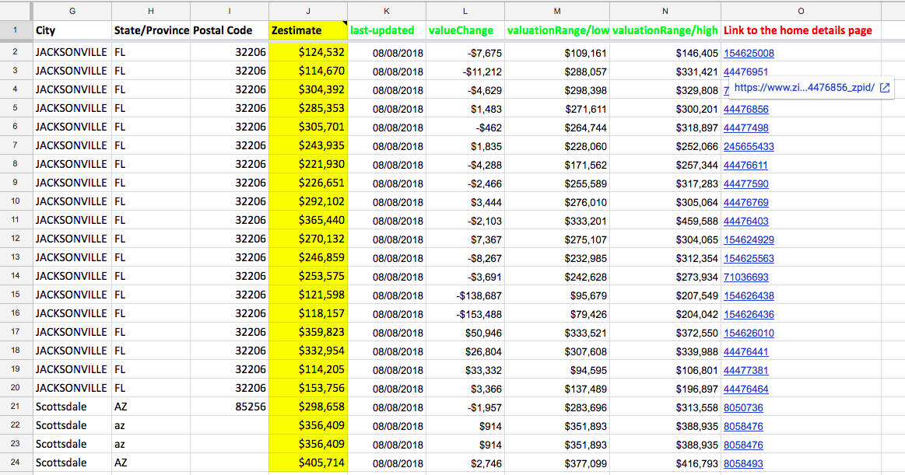

There are tons of ways to incorporate data from external services into your spreadsheets. `=GOOGLEFINANCE('GOOG', 'price')` is a good example.

Good news! It is easy to roll your own version of this for outside services too!

But how do we go about doing that? First you need to open your script editor. Any functions you build in here can be accessed by the bound document.

```javascript
function GETZESTIMATE(address, citystatezip) {
  // your code will go here
}
```

When I am writing custom functions I stick to the standard format of all capital letters. We can use this function with `=GETZESTIMATE(...)` from the spreadsheet just like all of the built in functions.

But what does the code itself look like? Well, that is the tricky part. For this example, here you go. Comments in the function try to explain what I am doing

```javascript
var ZWSID = PropertiesService.getUserProperties().getProperty('ZWSID');
//check that you have defined an API key in the User Properties
//to get an API key check: https://www.zillow.com/howto/api/APIOverview.htm
if(!ZWSID) return 'Need to set an API key';

var url = 'http://www.zillow.com/webservice/GetSearchResults.htm?';

//the first parameter is the address to get an estimate for
//if you pass a single cell no problem
//if you pass a range of cells it reduces the into a string
var addressParam = (typeof address === 'string')
  ? address
  : address.reduce(function(acc, cur) {return encodeURIComponent(acc + ' ' + cur);}, '');

//similar situation for city/state/zip code
var citystatezipParam = (typeof citystatezip === 'string')
  ? citystatezip
  : citystatezip.reduce(function(acc, cur) {return encodeURIComponent(acc + ' ' + cur);}, '');

//create an object for the request objects
var queryParams = [
  'zws-id=' + ZWSID,
  'address=' + addressParam,
  'citystatezip=' + citystatezipParam
].join('&');

//fetch the Zestimate from the API and parse it into an XML object
var xml = UrlFetchApp.fetch(url + queryParams).getContentText();
var document = XmlService.parse(xml);

//return the Zestimate to the spreadsheet! This is what appears on your spreadsheet
return document.getRootElement()
  .getChild('response')
  .getChild('results')
  .getChildren()[0]
  .getChild('zestimate')
  .getChild('amount')
  .getText();
}
```

Pretty cool right? Well let's go one step further and actually provide some help to ourselves when we use this in the spreadsheet. It is always nice to see those popups so we can be reminded what the parameters of our function actually do.

Just add this directly above the function!

```javascript
/**
 * get the ZPID for a location from the zillow api
 *@param {"1600 Pennsylvania Ave"} address The street address to search. (optional) You can use a range of values if you store the address in multiple cells
 *@param {"Washington DC"} citystatezip The city, state, and zip code to search. (optional) You can use a range of values if you store the address in multiple cells
 *@return {number} The Zestimate of the property found
 *@customfunction
 */
```

This is a pretty useful tool if you work in real estate or if you are just interested in buying a house. There are tons of other services that can easily be integrated. Happy coding!
