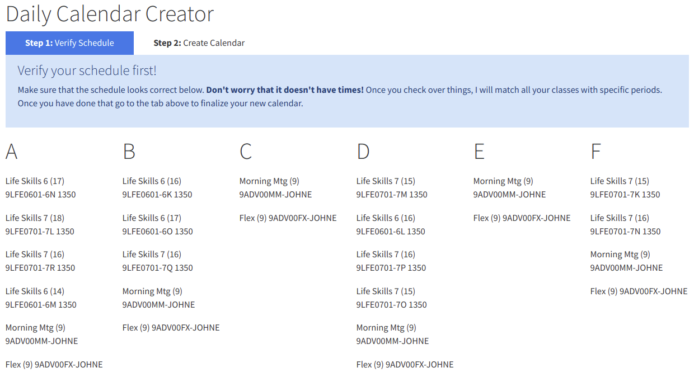

<iframe width="560" height="315" src="https://www.youtube.com/embed/2KeWQFL7htg" frameborder="0" allow="accelerometer; autoplay; encrypted-media; gyroscope; picture-in-picture" allowfullscreen></iframe>

### Building an Office365 Calendar Tool on a 6-Day School Cycle

When this project was first proposed to me, I had a hard time figuring out what a 6-day cycle even was! But once I got it, it made sense and ended up being a really great way to learn a few new things about `reduce`, `map`, and `filter` functions.

This tool built on Node with a framework called Express. The server side simply serves up the React application and then handles all of the API requests.

An administrator has to load all of the schedules into the database. The schedules are exported into Microsoft Excel and can then be imported into the Sqlite3 database directly from Onedrive using the Microsoft Graph API.

When users log into the application, the server matches their Microsoft username with the username from the IR database that is maintained by the school. And the schedule displays like...

Once you have looked over everything and click the go button... the server will batcha all of the times, perform some magic, and finally send them off to Microsoft to create in your Outlook calendar!

Let me know what you think! I would love to build more tools like this in the Microsoft ecosystem, but I need to hear about real life problem areas with your use of the services provided by Office 365.
