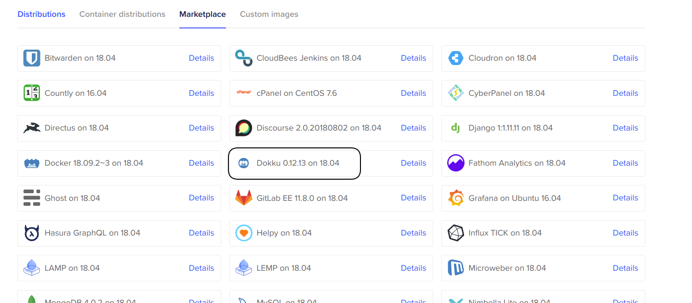
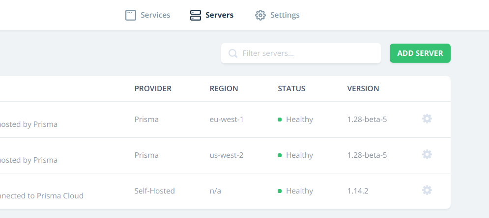

The new Wes Bos course is called "Advanced React and GraphQL" and I can't leave out a shout out to how much I enjoyed going through the course. I even went back and did it a second time to reinforce what I learned, and then took some of the things from his NodeJS course and added that to my app.

The only thing I didn't like about the course were the deployment steps. I wanted to create a way to house all 3 components (prisma server, graphql-yoga server, and the next.js frontend) all in the same place. The cheapest solution I could find: **Dokku**!

I am going to walk through the steps I took to get everything set up. The attached video hits all of the points and shows a few of the goofs I made along the way. I am using [Digital Ocean to host my Dokku server. You can use my referral link to help me out!](https://m.do.co/c/80d1e1920b23)

### Setup your DNS servers

You need to take a visit to your domain registrar and change your DNS servers to the Digial Ocean nameservers:

- ns1.digitalocean.com
- ns2.digitalocean.com
- ns3.digitalocean.com

### Digital Ocean

Once you have done that it takes a little while for the DNS servers to propogate, but you can go ahead and start the 1-click droplet creation.



The rest of the settings are pretty straightforward. If you want to set up an ssh key you will have to follow the steps provided on Digital Ocean. It is different on different systems!

When the droplet is done building, just take a visit to the domain and make sure that the you have virtual naming selected. This allows each container to take the corresponding subdomain.

### Deployment time

I followed the steps provided directly in the [Prisma documentation](https://www.prisma.io/tutorials/deploy-prisma-to-dokku-ct15). If you are interested in using Let's Encrypt to provision SSL certificates for your server, you can find examples of how to do that in my video.

### Prisma

Now that you have a Prisma server, you need to create the service for your yoga server.

Ssh back into your Dokku server and create a container called `yoga`

```bash
# how to create a container
dokku apps:create yoga

# how to add environment variables
dokku config:set yoga ENV_VARIABLE_NAME="ENV VARIABLE STRING"
```

### Yoga

Add your new prisma server to the prisma dashboard



### Deploy your Front End container

First, `ssh` back into your Dokku server.

```bash
dokku apps:create example.com
```

This will put your frontend on the root of your domain. You could also tell it to point www.example.com to your root also, but that is up to you. Before you push that up to you the server you need to create 2 files in the root of your front-end project.

app.json

```json
{
  "scripts": {
    "dokku": {
      "predeploy": "npm run build"
      // OR if you use yarn
      //"predeploy": "yarn build"
    }
  }
}
```

Procfile

```bash
web: npm start -- --port $PORT
# OR if you use yarn
# web: yarn start --port $PORT
```

Then just create the `git remote add dokku dokku@server:CONTAINERNAME` and push your project.

### SSL Certificates

If you watch my video you see that I am using a [Dokku plugin for Let's Encrypt](https://github.com/dokku/dokku-letsencrypt) to provision SSL certificates. It is super simple to do.

Just install the plugin with `sudo dokku plugin:install https://github.com/dokku/dokku-letsencrypt`. Then set a global email address with `dokku config:set --global DOKKU_LETSENCRYPT_EMAIL=your@email.com`

This gives you access to run `dokku letsencrypt CONTAINER` on any of your containers to provide them with HTTPS.

### Wrap-up

I know I missed a lot of steps in my write up, but the video is much more comprehensive. Let me know what I missed in this write up below! I am always trying to improve. Always learning is the way I roll.
