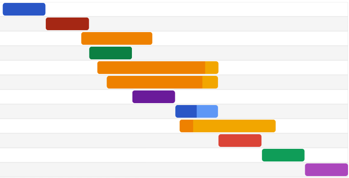
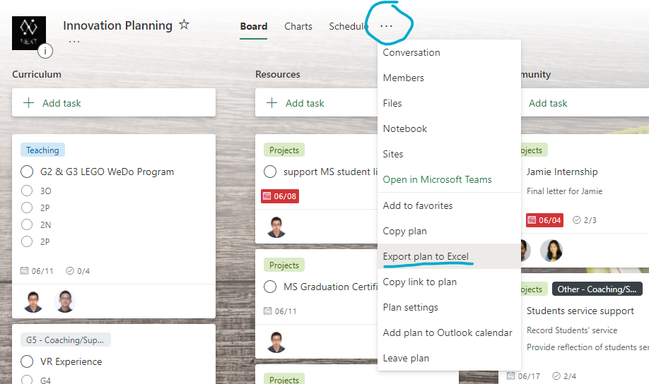
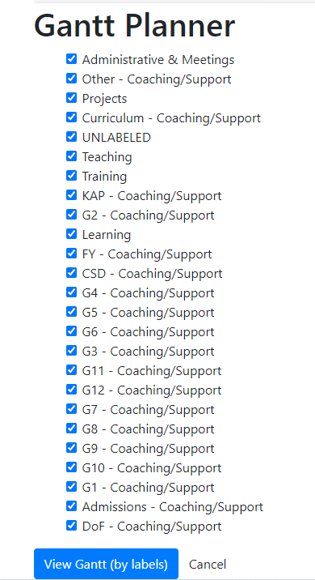
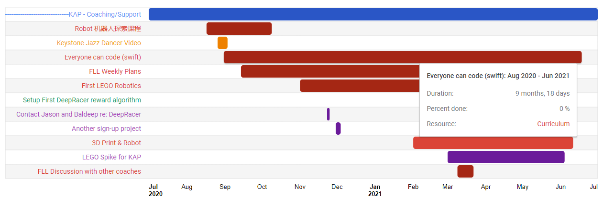

<figure>
    
</figure>

## Horizontal and vertical planning with Gantt Charts

In our office we are using Microsoft Planner to keep track of the projects and tasks that we are working on. In a school as big as this, there are lots of planning problems especially since our department touches so many different parts of the school world.

My solution for the end of the year planning retreat was to put together a small web app that would leverage the [Google Charts](https://developers.google.com/chart) to create charts we can use for planning.

## Simple Steps

**First step**

Save the Microsoft Planner as and excel file.

<figure>
    
</figure>

**Second step**

Import the export into [gantt.jordanrhea.com](https://gantt.jordanrhea.com) and you will have the choice to select any or all of the labels that you have already defined in your planner.

<figure>
    
</figure>

**Final step**

Use the results!

<figure>
    
</figure>

Each label that you select becomes its own gantt chart. Currently it is set up to work with our schedule, but I wonder how I can improve the code to make it more dynamic. Perhaps there needs to be some date selects to toggle different views easily for different planning groups.
