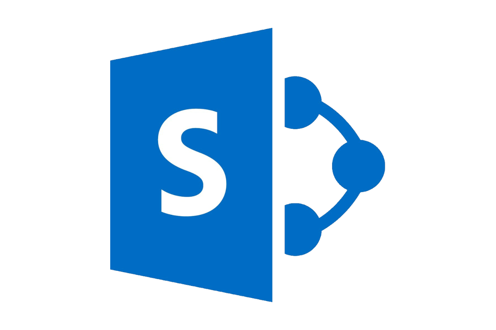
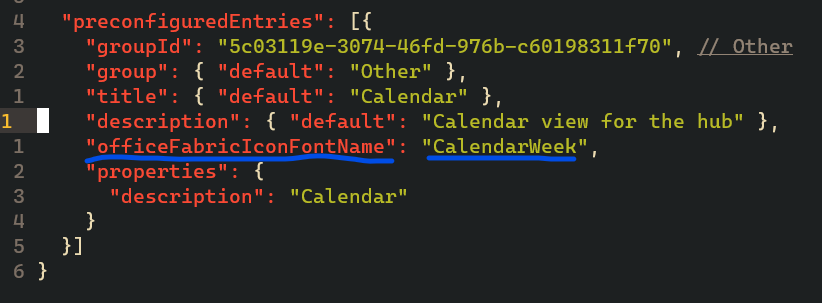

<figure>
    
</figure>

## Update SPFx dependencies to 1.12.1 from 1.11.0

Very simple process, but I had to scour the web for a few things before I got it right. Obviously, the easiest thing to do is start from scratch with a fresh 

`yo @microsoft/sharepoint`

but obviously not the ideal.

## Set an icon for your webpart

[Another simple trick that I will summarize here](https://docs.microsoft.com/en-us/sharepoint/dev/spfx/web-parts/basics/configure-web-part-icon)

It is very difficult to sort out those webparts once you start adding them to your tenant. Use the fabric icons that are built right into Sharepoint to help yourself differentiate between all of the different parts.

Just open the `...manifest.json` file that is created along with your webpart. Then change the 

<figure>
    
</figure>

## Bundle webparts together

Just run the `yo @microsoft/sharepoint` command inside an existing project directory. Yeoman will understand what it is doing and add a folder right inside that project without having to provision another 12 bajillion dependencies for development.

The other benefit is the ability to share components between each part.
