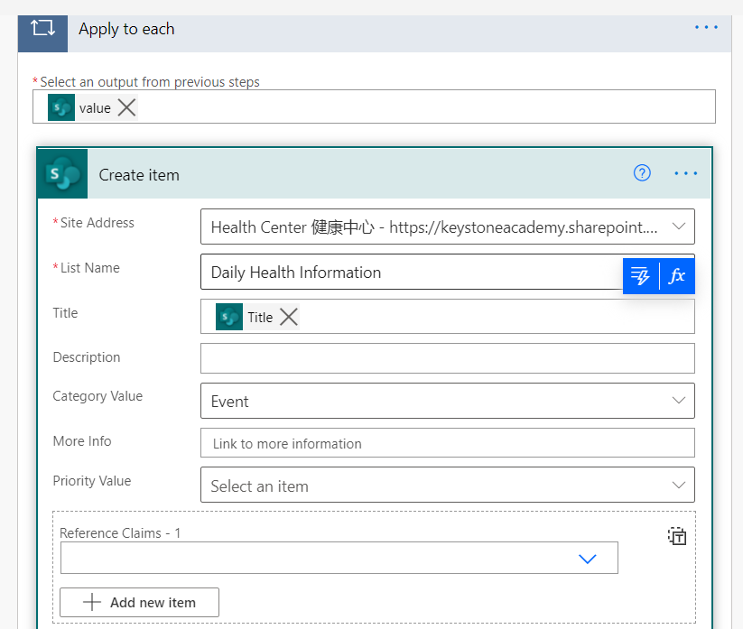

<figure>
    
</figure>

When using Microsoft Lists I am often running into a situation where I need to copy information into or out of a list. There are a bunch of ways to accomplish this.

I am going to talk about one of those ways here...

**First, contemplate just combining the lists!** Do you need two places to have the same information? It may make more sense to maintain a **SINGLE** list and create multiple views for your list.

**Ok! So you are fine with multiple lists...** Let's go through an automation to copy items from one list to another.

## Find your way to Power Automate

Click on create along the left hand navigation. Then you are looking for 'Instant Cloud Flow'. Since we only need this flow once (or potentially very rarely) there is no need to make it automatic.

<figure>
    
</figure>

## Give your Flow a name

Then make sure you select 'Manually Trigger a flow'

<figure>
    
</figure>

## The first action of your flow...

Get all of the items from the first list. Easy to do. Just click on 'New Step' and then search for the sharepoint action 'Get items'

<figure>
    
</figure>

## Where is your list?

You know better than I do. The first dropdown is the site of your list. The second dropdown is your 'List Name'. These are the only two required selections. However, I like to set the Top Count to a value higher than the number of items in my list. This silences some of the warnings they throw at you. You can safely (I think?) ignore those warnings anyways.

<figure>
    
</figure>

## Next up, where are the items going?

You need to add another sharepoint action called 'Create item'. This is a super simple one at first, but as soon as you select your list name, it will expand out to show all of the fields that you can complete.

<figure>
    
</figure>

You need to match up each column from where it is starting to where it is going. The bigger your list, the more difficult this is.

<figure>
    
</figure>

## Once you are done...

Just click on 'Save' in the upper right corner. Then 'Test' to start it up. Just click on the various menus that appear. They are just authenticating you with your lists.

<figure>
    
</figure>
