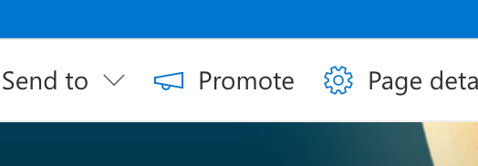
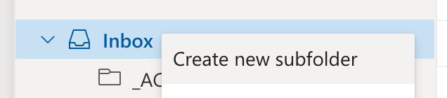
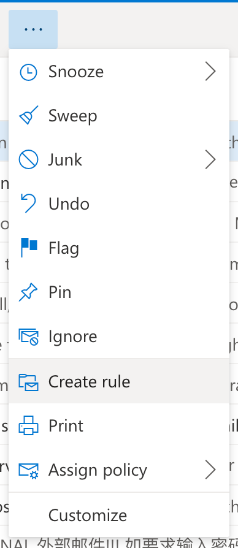
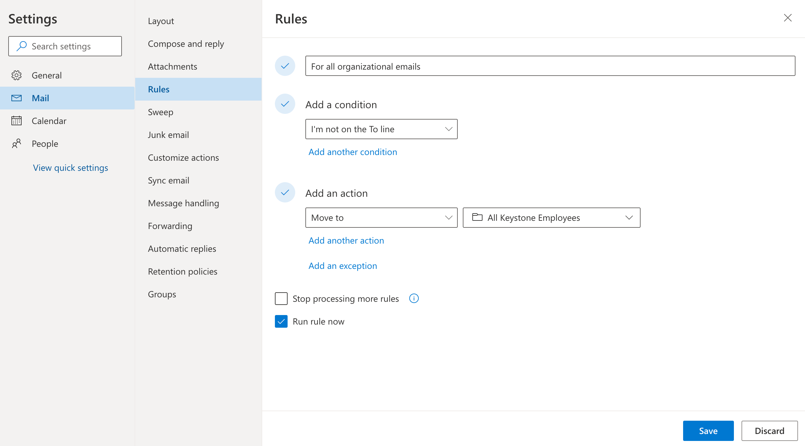

So you have convinced your organization to move those large organization wide emails over to Sharepoint and build a network of sites that really put the "share" into "Sharepoint"? Well guess what, each announcement on a site comes equiped with a promotion button with the sole purpose of simplifying the email generation process.

So has the whole point been defeated? Why are we checking Sharepoint and Outlook all-day everyday?

Relax, there is a solution! We just need to better organize our Outlook emails to take those mass emails out of the main window and put them somewhere out of the way!

**First**

We need to create subfolder to contain all of the emails we are going to be getting. You can call this whatever you want, however, I suggest being very clear whenever you name anything.

**Second**

You have to open the rule window. There are lots of options here so keep your eye open for other potential rules that may help out in the future. Always have the mindset to make your software do as much of the manual labor as possible.

**Third**

Create the rule! To get into the view below you will probably have to click on a `More Options` link. Once you have something that looks like the image below, just go ahead and select the options that you need. Below you can see the decisions that I made.

That is it! You now have a rule that will put all of the emails that are not sent to you, into a folder all of their own. How can you possibly improve this flow? Well, maybe you can add category tags to each of the emails that come in. Or, you could try marking them all as read automatically. Maybe, you want different sub-folders for different people.

There is no end to the possibilities!

