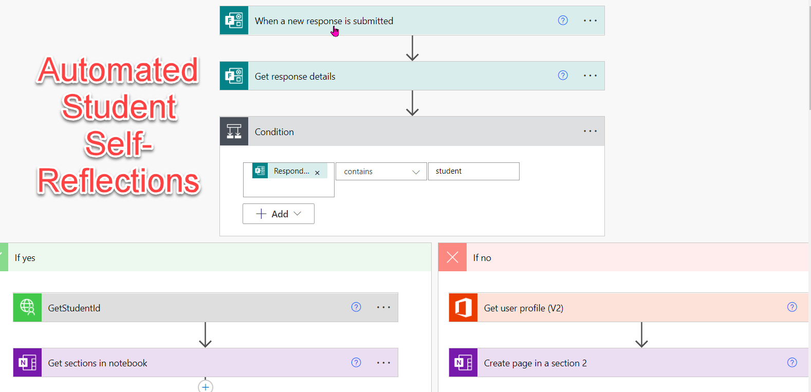
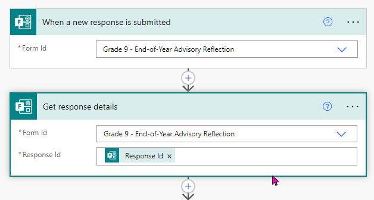
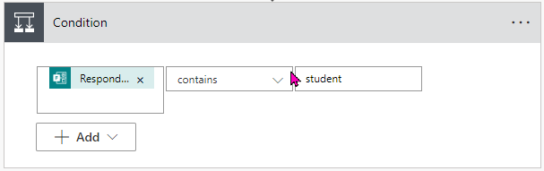
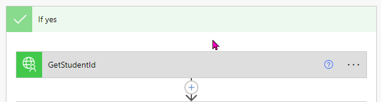
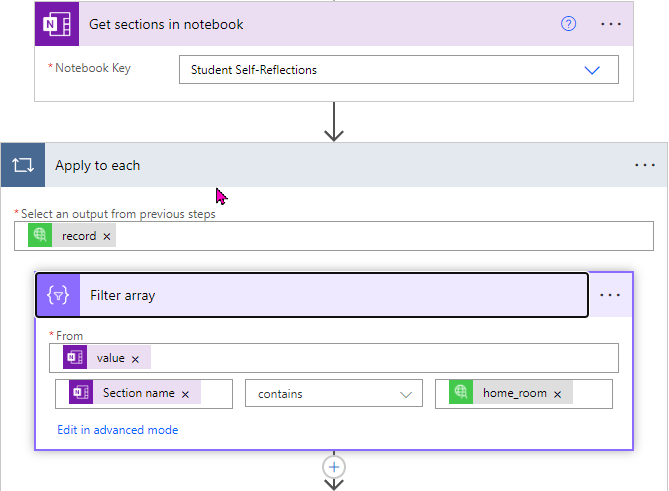
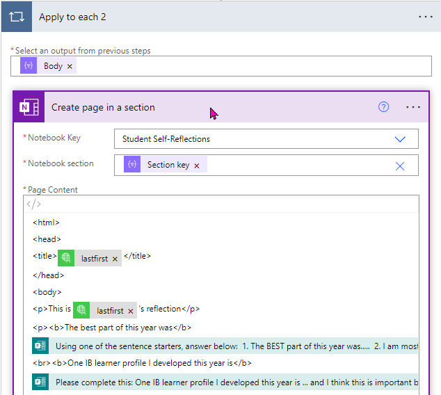
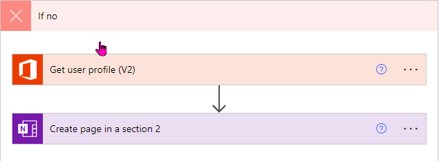

## The greatest trick of classroom time saving is how to gather information from your students.

Whether it is how you are collecting their homework, assessments, or feedback, you are just trying to take their input and handle it with efficiency. Microsoft Forms allows you to do that in a standardized way.

The first thing you need to do is design your form. Simple enough once you are familiar with how Forms works.

[See an example of the form that I used here](/blog/automated-student-self-reflections/reflection-form)

The next step is handling the form inputs once they are submitted. We will use Power Automate (formerly known as Flow) to do this. I am going to try and break down the flow I made for my use, however, your use may differ. Let me know in the comments below, how you implemented something similar!

The first two blocks get the form itself and then get the responses.

The next block defines the condition to handle different cases. You could omit this if all of your responses will be handled the same way. However, students will be handled different than teachers responding. The way I differentiate is in this block determining if the word `student` is in the email address.

If the condition is `YES` then I run a custom connector that connects to PowerSchool to get more information about the student. Then I grab all of the sections in the OneNote notebook. In the next block I will filter these to match the `home_room` information returned from PowerSchool.

Specifically which homeroom they are inwhich I match up with the different sections in OneNote.

Once I have that, I use the `Create page in a section` block to write the actual HTML code. Just drop in the connections to dynamic data and away you go!

I also have included a `NO` condition that handles the form if someone like a teacher completes the form. This step is optional, but I wanted a way to handle my own completion of the form!

How would you go about completing something similar? Is there something that I have not explained well? I would love some feedback! I have been out of the practice of documenting my work, and it is time that I get back into it.
