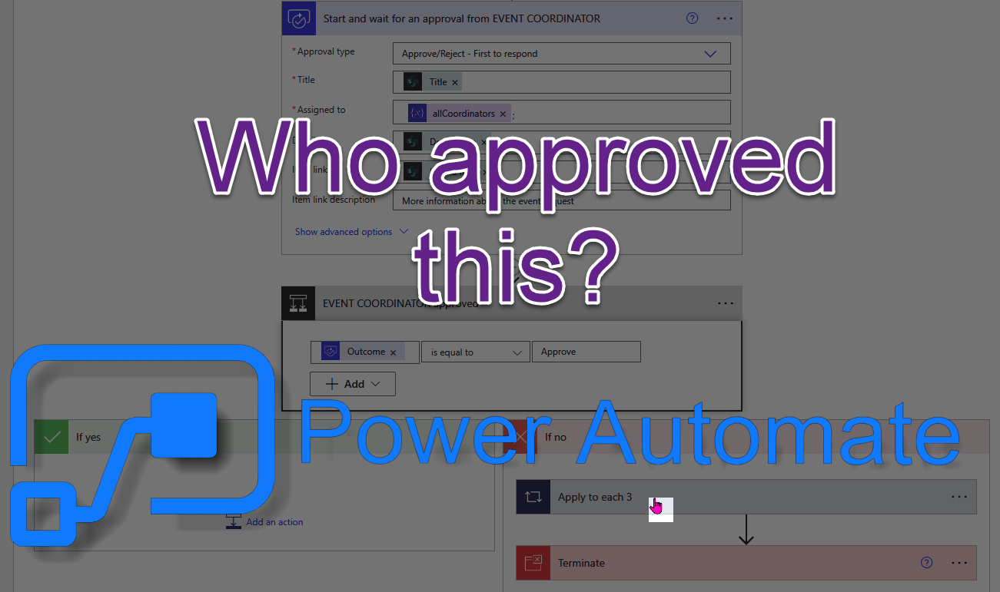
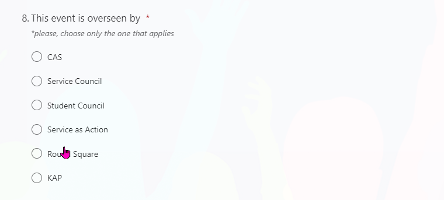
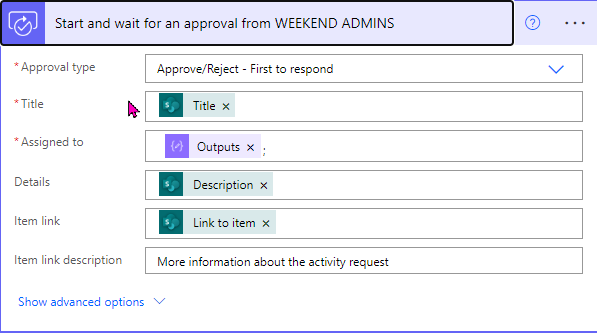

Have you ever needed a document signed, walked across the campus and the signer was off at lunch? What if there was a way to get these kinds of signatures

## There is a way using approvals

In this case I needed an approval that replaces the need for running all over the building looking for the correct people to sign a document. Students need a series of signatures before embarking on various service activities.

The first thing we need to do is gather the required starting information. This is as simple as building the form. In the form we use a choice block to define the different departments whose signatures are needed.



Then we build the flow around the responses to that form. If we structure the form correctly it is fairly simple. If you don't you will end up adding a bunch of extra blocks trying to format things. Either way is preferable to having your students run all over the show.

One of the first steps in the flow is adding a compose block. This is where I just created a JSON object of the different approvers who need to approve depending on the response in the form.

```json
{
  "CAS": [
      ...
  ],
  "Service Council": [
      ...
  ],
  "Residential Life": [
      ...
  ],
  "Weekend": [
      ...
  ]
}
```

This works for me because it matches exactly with the responses from the form. However, the beauty of these blocks is that you can configure them to your needs.

Then we have got to send the approval to someone. I will skip over the logic specific to this school. I guarantee yours is simpler. Doesn't matter! The more complex you make these, the more satisfaction you get when you see the approvals coming in!



We want to send the comments back to the student if their request is denied. We can do that here, I ended up just leaving the `true` condition empty to pass onto the next block. The `false` condition sends an email with the comments.


When all of the logic resolves, I am saving all of the results back to a list on Sharepoint where it can be reviewed by the different coordinators. I also generate an email giving the students information about the next steps.

There is tons of utility for approvals like these, plus they go to both Teams and Outlook and can be done in a few simple clicks.
