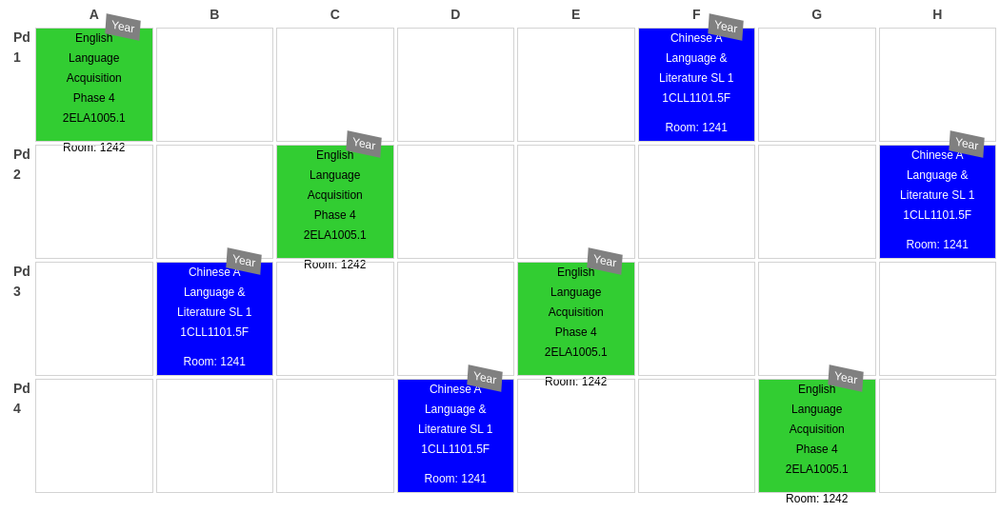

### PowerSchool has a super extensive customization system, however learning how to use it effectively takes a considerable amount of overhead.

I have spent a significant amount of time in the past few months learning the ins-and-outs of everything PowerSchool. I wanted to share a code snippet that takes the `expression` field from PowerSchool and cascades it throughout the cycle.

First, let me explain a bit about the schedule at this school. The requirements are for 8 day cycles of 4 periods each day. The goal is that each course does not occur at the same time during the cycle.

Here are some examples of what that looks after coming from PowerScheduler:

`1(A,B,C,D,E,F,G,H)` represents 1st period each day of an 8 day cycle. We want this one to stay the same as it represents "community time" at the end of the day.

`1(A,C,E)` represents 1st period on days A, C, and E. This we want to cascade into `1(A) 2(C) 3(E)`

`2(B,D,F,H) 1(A)` represents 2nd period on B, D, F, and H days and also 1st period on A day. This would cascade into `2(B) 3(D) 4(F) 1(H) 1(A)`

Here is the code I wrote to accomplish this. I wrote it as a custom function that coule be used directly into a spreadsheet:

```javascript
const days = ["A", "B", "C", "D", "E", "F", "G", "H"];

/* @customfunction */
function COUNT_MEETINGS(expression) {
    const mtgs = expression.split(" ");

    let count = mtgs.length;
    mtgs.forEach(m => {
        let [period, days] = m.split("(");
        days = days.substring(0, days.length - 1);

        if (days.includes(",")) {
            days = days.split(",");
            count = days.length > 2 ? days.length : count + 1;
            return;
        }

        if (days.includes("A-H")) {
            count = 8;
            return;
        }

        if (days.includes("-")) {
            days = days.split("-");
            count = 2;
            return;
        }
    });

    return count;
}
```

Some of this code could certainly be tightened up. Having several `if(...)` statements at the end to handle the different options in the expressions is not ideal.

HOWEVER!!! Sometimes speed trumps the need for pristine code. Being able to do this in minutes was the ideal situation for solving this problem.

Is this even a problem that other school's encounter? I have no idea how complex school schedules can get, but this certainly helped me with the complexity of this schedule.
