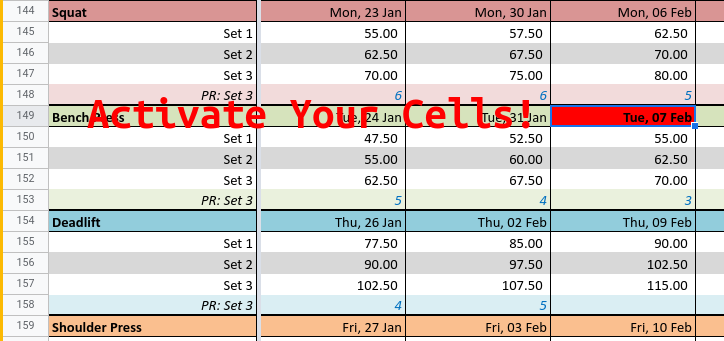
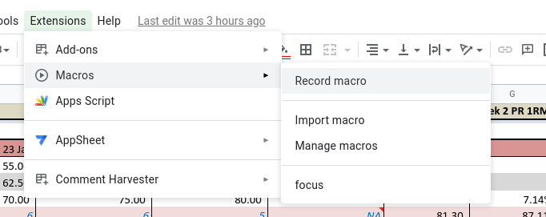
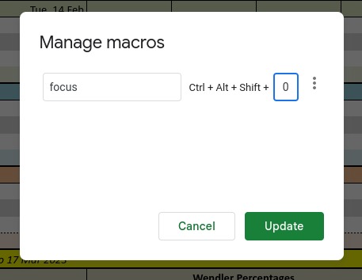

I was getting annoyed with a spreadsheet that I use to track gym sessions. Getting the screen to focus on the correct cell was not working the way that I wanted.

Well turns out, I can code that into the sheet myself

```javascript
function focus() {
  const sheet = SpreadsheetApp.getActive().getSheetByName(SHEET_NAME);
  const range = sheet.getDataRange();
  const vals = range.getValues();
  const today = new Date();
  
  for(let y = 0; y < vals.length; y++) {
    const x = vals[y].findIndex(cell => cell instanceof Date && cell.toDateString() === today.toDateString());

    if(x > -1) {
      // this ends the for loop at the first instance of the date that is found
      return sheet.getRange(y + 1, x + 1).activate();
    }
  }
}
```

Once you have this in your script editor, just set it to a macro. You can even add a keybinding to that macro!






