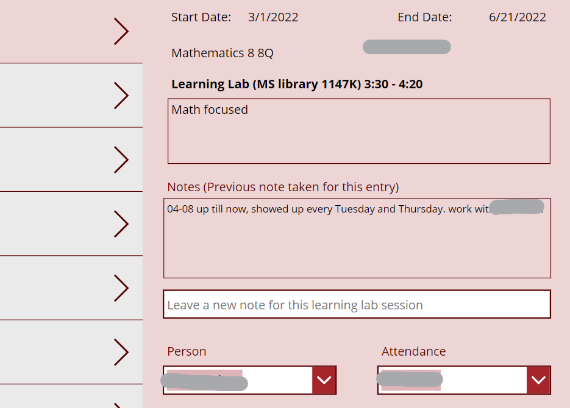

### The movement to develop "low-code" and "no-code" tools that make development accessible to everyone. This only means great things for development!

Tools like **Microsoft's Power Apps** and **Google's AppSheet** allow customized development based on specific needs. And then when those needs change, so does the tool!

This support system allows for exactly that. Leveraging the power of **Power Apps** and **Sharepoint Lists**, users have much more control over the tool.

Teachers need to request academic support from the school's learning center, and in a school of this size that is not as easy as it sounds. Building a tool that allows teachers to request that support. It also allows different teams to be notified when students under their care are scheduled. It also allows administrators to manage who is providing support. Many moving parts, that are not individually difficult, however, steps in a process that can be modified.
