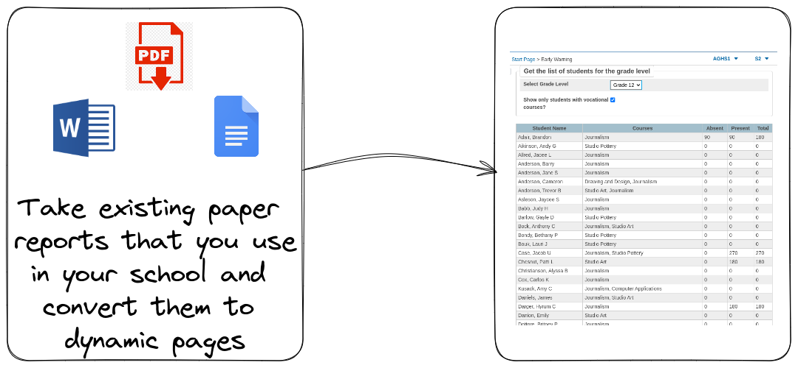

## PowerSchool is a web-based student information system used by schools and school districts to manage student data.

It allows teachers to keep track of grades, attendance, and assignments, as well as communicate with parents and students. PowerSchool also offers a range of features for administrators, including the ability to create and manage schedules, generate reports, and track student performance. Overall, PowerSchool helps schools streamline their administrative tasks and improve communication among teachers, students, and parents.

### However, not all tools are "one size fits all"

Web development can be used to create plugins for PowerSchool, allowing for the creation of custom features and functionality tailored to a specific school's needs. Plugins can be used to extend PowerSchool's core functionality, such as adding new reports, automating administrative tasks, or integrating with other systems. By leveraging web development skills to create PowerSchool plugins, schools can improve their productivity, enhance the user experience, and better meet the needs of their students and staff.

Here are some examples of how I have leveraged PowerSchool to build custom tools for schools:

### Reports

Take the documents you use currently, and create digital versions that can be accessed directly from PowerSchool. You can also bulk create documents into a single file, make the process of generating reports easier on your staff.

### Dynamic Dashboards

A dynamic data dashboard is more advantageous than a typical export file. It offers real-time data visualization with charts, graphs, and other visual aids that make it easier to identify patterns and trends. Dashboards are customizable and interactive, allowing users to filter, sort, and drill down into the data for more detailed analysis. Moreover, they can be accessed from anywhere with an internet connection and shared with others, enabling better collaboration. In summary, a dynamic data dashboard provides a more intuitive and accessible way to analyze and interpret data.

### Automation

Create events from the most current state of your database.

-   Create daily emails for advisors about the weeks attendance and behavior entries.
-   Notify teachers of students who are scheduled for extra academic support.
-   Create parent updates of how their students are performing based on standards.
-   Add teacher courses to Microsoft Outlook calendars
-   Send Microsoft Teams messages on student birthdays

Each of these actions alleviates burden on your staff and teachers
